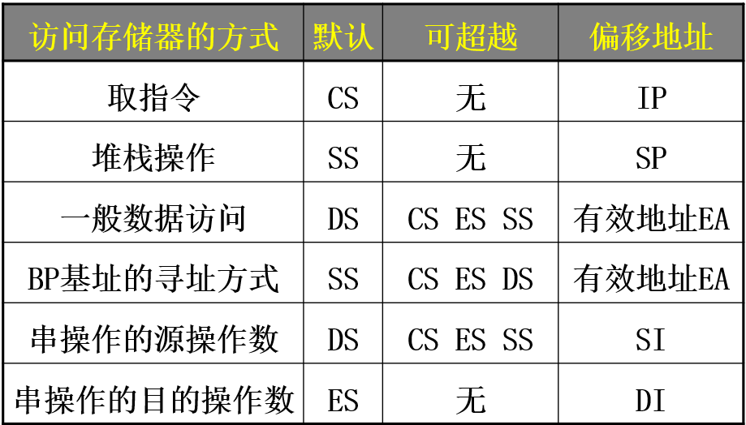

# 80x86汇编笔记

## Register

### 8086的寄存器


### 段寄存器

1. **程序的指令序列**必须安排在代码段

2. **程序使用的堆栈**一定在堆栈段

3. **程序中的数据**默认是安排在数据段，也经常安排在附加段，尤其是串操作的目的区必须是附加段



8086对逻辑段要求：

1. **段地址低4位均为0**

2. **每段最大不超过64KB**

8086对逻辑段并不要求：

1. 必须是64KB

2. **各段之间并不要求完全分开（即可以重叠）**

### FLAG

1. CF和OF的区别

CF是对无符号数运算有意义的标志位，OF是对有符号数运算有意义的标志位。

二者的值没有必然联系。

2. PF

1的个数是否为偶数

3. SF

结果是否为负

4. DF

df=0，每次操作si，di递增；否则递减

## Basis

### 寻址方式

#### 立即数寻址

```assembly
mov ax, 1000H
```

#### 寄存器寻址

```assembly
mov ax, bx
```

#### 存储器寻址

1. 直接寻址

```assembly
mov ax, [2000h] ;默认为DS段
mov ax, es:[2000h]
```

2. 寄存器间接寻址

```assembly
mov ax, [si] ;默认为DS段
```

只能是BX, SI, DI, BP；

3. 基址变址寻址

只有4种组合

```assembly
mov seg, [bx/bp + si/di]
```

bx默认段为ds, bp默认段为ss

4. 寄存器相对寻址

在2的基础上加上偏移的立即数

5. 相对基址变址寻址

在3的基础上加上偏移的立即数

### 操作数位宽

有寄存器名时, 以寄存器名为准

无寄存器名时, 用`X ptr`来指定长度, 其中X可以为`byte`和`word`

例外: push只进行字操作

### 基本数据类型

汇编语言基本数据类型汇总:

DB:Define Byte,定义字节(8位/1字节)无符号整数;等同于BYTE;

W:Define Word,定义字(16位/2字节)无符号整数;等同于WORD;

DD:Define DoubleWord,定义双字(32位/4字节)无符号整数;等同于DWORD;

DF:Defined Farword,定义三字(48位/6字节)无符号整数;等同于FWORD;

DQ:Define QuadWord,定义四字(64位/8字节)无符号整数;等同于QWORD;

DT:Define TenBytes,定义五字(80位/10字节)无符号整数;等同于TBYTE;

BYTE  : 8位无符号整数

WORD  : 16位无符号整数

DWORD : 32位无符号整数

QWORD : 64位整数

BYTE : 80位整数

SBYTE : 8位有符号整数

SWORD : 16位有符号整数

SDWORD: 32位有符号整数

FWORD : 48位整数(保护模式下作远指针)

REAL4 : 32位IEEE短实数

REAL8 : 64位IEEE长实数

REAL10: 80位IEEE扩展精度实数

## Instruction

### 算术运算类

#### MUL

```assembly
mul reg/mem
```

如果是8位，与AL相乘，结果放在AX

如果是16位，与AX相乘，结果放在DX AX

#### DIV

```assembly
div reg/mem
```

如果除数为8位，则被除数为AX，AL存储商，AX存储余数

如果除数为16位，则被除数为DX AX，AX存储商，DX存储余数

### 数据传送类

#### MOV

```assembly
mov reg, imm/reg/mem
mov mem, reg/seg
mov seg, reg/mem
```

- 不允许主存到主存的MOV
- 不允许段寄存器之间的直接数据传送
- 不允许段寄存器和立即数的MOV
- CS和IP不允许MOV, 往往通过JMP来控制

#### LEA

把源操作数的地址偏移量传送给目的寄存器

LEA 指令要求源操作数必须是存储单元，而且目的操作数必须是一个除段寄存器之外的16位寄存器。使用时要注意它与MOV指令的区别，MOV指令传送的一般是源操作数中的内容而不是地址。

```assembly
LEA REG16, MEM
```

### 位操作类

#### CMP

```assembly
CMP REG, IMM/REG/MEM
CMP MEM, IMM/REG
```

cmp不能比较两个存储单元, 不能比较两个立即数

当of=1时，说明有溢出，逻辑上真正结果的正负≠实际结果的正负

| cmp ah, bh | sf=0   | sf=1  |
| ---------- | ------ | ----- |
| **of=0**   | ah>=bh | ah<bh |
| **of=1**   | ah<bh  | ah>bh |

#### SHL/SHR

逻辑左移/右移

如果移动位数大于1，必须把移动位数放在**CL**中

最后移出的一位写入到CF中

###　串操作类

#### CLD

clear direction, 清除方向

将DF置0

SI, DI向前移动

#### STD

与CLD相反

将DF置1

#### MOVS

MOVSB：从SI向DI移动一个字节，然后根据DF来移动SI和DI

同理还有MOVSW，移动一个字

#### STOS

STOSB：将AL传送到ES:DI

同理还有STOSW，传送AX

#### LODS

LODSB：将DS:SI传送到AL

同理还有LODSW，传送到AX

### CMPS

CMPSB：DS:SI-ES:DI，根据结果设置标志位

同理还有CMPSW

#### SCAS

SCASB：比较AL与ES:DI，并设置标志

同理还有SCASW

#### REP

为了方便串的重复操作

不影响标志位的MOVS, STOS, LODS用REP前缀

影响标志位的CMPS, SCAS用REPZ和REPNZ

REP相当于循环，同样需要设置CX

REPZ：CX=0或ZF=0，则循环退出

REPNZ：CX=0或ZF=1，则循环退出

## Pseudoinstruction

### ASSUME

assume是伪指令，是给编译器看的，而不是最终对应机器码的

assume的作用是关联段名和段寄存器，但是本身不对程序产生影响

例如：如果在数据段中定义了变量名

```assembly
data segment
	x db 0
data ends
```

在代码中如果需要直接使用这个变量名

```assembly
mov al, x
```

如果不加assume就会报错，因为汇编器不知道用哪个段来索引x，不过也可以`ds:x`来引用

### OFFSET

```assembly
TABLE DW 10，20，30，40，50
```

定义以TABLE为首地址的五个数据; DW指字类型

```assembly
MOV BX,OFFSET TABLE
```

将TABLE的首地址传送给[基址寄存器](https://www.baidu.com/s?wd=%E5%9F%BA%E5%9D%80%E5%AF%84%E5%AD%98%E5%99%A8&tn=SE_PcZhidaonwhc_ngpagmjz&rsv_dl=gh_pc_zhidao)BX，OFFSET + 标识符，表示取X的首地址，整个语句的[寻址方式](https://www.baidu.com/s?wd=%E5%AF%BB%E5%9D%80%E6%96%B9%E5%BC%8F&tn=SE_PcZhidaonwhc_ngpagmjz&rsv_dl=gh_pc_zhidao)为立即数寻址，MOV在这语句中
起传送地址的作用.此时BX=TABLE(表示地址.)

offset是汇编时期计算的偏移地址, 所以不能够OFFSET [SI], 因为寄存器的值只有程序执行的时候才能确定, 此时必须用LEA

### DUP

dup 在汇编中是一条[伪指令](https://baike.baidu.com/item/%E4%BC%AA%E6%8C%87%E4%BB%A4)，用来重复初始化数据

用法举例：

str1 db 10 dup ('!@#') ;这就是十个！@#

格式：db 重复的次数 dup (重复的内容)

注: ?表示未定义

### REPEAT

```assembly
REPEAT 重复次数
	重复体
ENDM
```

例如：

```assembly
char = 'A'
REPEAT 26
	db char
	char =  char + 1
ENDM
```

定义了26个大写字母的数据

### FOR

```assembly
FOR 形参, <实参表>
	重复体
ENDM
```

例如：

```assembly
FOR regad, <ax, bx, cx, dx>
	push regad
ENDM
```

相当于依次push四个寄存器

### FORC

```assembly
FOR 形参, 字符串
	重复体
ENDM
```

例如：

```assembly
FORC regad, dcba
	pop &regad&x
ENDM
```

相当于依次pop四个寄存器

## Transfer

条件转移只能段内转移, 即目标地址只能是在同一段内，且在当前IP地址-128~+127个单元的范围之内。这种寻址方式由于是相对于当前IP的，所以被称为相对寻址方式。

无条件转移可以段内(相对, 间接)和段间(直接, 间接)寻址

## Miscellaneous

### 程序头

```assembly
.386 ;指明指令集
.model flat,stdcall ;程序工作模式
;flat为Windows程序使用的模式(代码和数据使用同一个4GB段)
;stdcall为API调用时右边的参数先入栈
option casemap:none ;指明大小写敏感  
```

### 立即数前缀

汇编源程序中立即数不能以字母开头, 否则要加0前缀

### BCD码

二进制编码的十进制数(Binary Coded Decimal)

压缩BCD码：一个字节表达两位BCD码

非压缩BCD码：一个字节表达一位BCD码

> BCD: 0100 1001 0111 1000.0001 0100 1001
>
> 十进制真值：4978.149

BCD码便于输入输出

### ASCII

标准的ASCII码用7位二进制编码，有128个